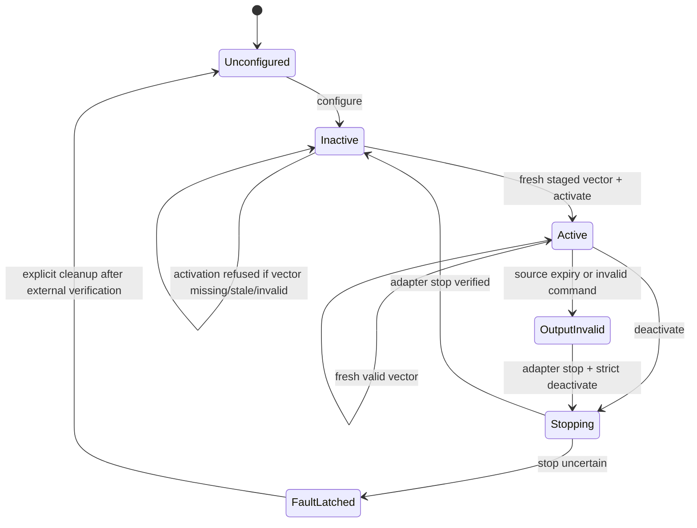

# Forward actuation controller implementation specification

Status: IMPLEMENTED; RIGHT-ARM SUPERVISED CURRENT-DOMAIN COMMISSIONING PASS; PRODUCTION L3 BLOCKED

This document turns `joint_actuation_interface_rfc.md` into an implementation contract. It is intentionally robot-independent first, then records the RealMan RM75 binding used by this workspace. A future robot integration may replace only the adapter and its conformance profile; it must not weaken the controller, ownership, timing, stop, evidence, or command-domain contracts defined here.

## 1. Goals and non-goals

The implementation provides one guarded ROS 2 controller plugin for direct joint actuation:

- current domain: `ACTUATOR_CURRENT_A`, unit A;
- torque domain: `JOINT_TORQUE_NM`, unit N*m at the load-side joint;
- exact ordered whole-group commands;
- an expiring command-source lease;
- deterministic stop behavior;
- adapter-independent status and evidence.

The first hardware binding is the right RealMan RM75 at `192.168.10.18`. Its accepted public domain is current only. It does not claim calibrated joint torque.

This implementation does not include:

- zero-force drag, impedance, gravity, or friction control laws;
- automatic A-to-N*m conversion;
- arbitrary subsets of a declared atomic joint group;
- direct user access to vendor sockets, SDK calls, or raw counts;
- automatic hardware authorization merely because software tests pass.

## 2. Naming and package boundaries

### 2.1 Generic controller

Package:

```text
src/joint_actuation_controller/
```

Plugin type:

```text
joint_actuation_controller/ForwardActuationController
```

Recommended instances:

```text
<arm>_forward_current_controller
<arm>_forward_effort_controller
```

The plugin name is domain-neutral because the same lifecycle and safety logic applies to current and torque. The instance name is domain-explicit because it is the operator-facing entry point.

### 2.2 Generic interface

The stable transport/session abstraction remains `JointActuationPort` in a future independent package:

```text
src/joint_actuation_interface/
```

The first implementation may use ros2_control loaned command interfaces as the in-process port realization. It must preserve the same state machine and evidence fields so the concrete transport can later be replaced without changing controller semantics.

### 2.3 Vendor adapter

RealMan-specific transport remains in:

```text
src/rm_control/
```

It owns:

- `current_canfd` JSON serialization;
- A-to-raw conversion;
- current-mode enable/readback/disable;
- UDP state decoding;
- RealMan endpoint identity and firmware facts;
- vendor-specific stop verification.

It must not own gravity or impedance laws.

## 3. Command-domain contract

### 3.1 Public resources

| Domain | ros2_control command resource | Public unit |
|---|---|---|
| `ACTUATOR_CURRENT_A` | `<joint>/actuator_current` | A |
| `JOINT_TORQUE_NM` | `<joint>/effort` | N*m |

The configured `command_domain` and claimed resource suffix must match. Configuration fails otherwise.

### 3.2 RealMan mapping

RealMan RM75 exposes:

```text
public:  <joint>/actuator_current, double, A
private: current_canfd raw integer count
mapping: round(A * 1,000,000)
```

The verified direct-command transfer is uniformly `0.001 mA/count` for J1-J7. Saturation is applied in A before conversion and checked again after quantization. Raw counts never cross the generic controller boundary.

`CurrentReference` is `kVendorControlCurrent`. This does not assert q-axis, phase RMS, bus current, or a known torque constant.

### 3.3 Command message

The external commissioning ingress is:

```text
std_msgs/msg/Float64MultiArray on ~/<instance>/commands
```

Rules:

- exactly one finite value per configured joint;
- array order is exactly the configured `joints` order;
- no implicit partial update;
- no NaN or infinity;
- no retained pre-activation command from an earlier generation;
- every accepted message gets a local steady-clock receive time and generation;
- DDS source stamps are audit data only, never the lease clock.

A later high-bandwidth control law should chain in-process. It must not depend on DDS timing.

## 4. Controller state machine



Normative behavior:

1. `on_configure` validates the joint list, domain, limits, lease, and resource names. It performs no hardware output.
2. While inactive, a command may be staged only for the next activation generation. It expires normally and cannot survive cleanup.
3. The controller manager assigns resources, then `on_activate` requires a fresh staged vector and writes it to every loaned resource. Missing, stale, malformed, or superseded input rejects activation.
4. On source expiry the controller writes NaN to every resource and returns `ERROR`. If the adapter verifies current-disabled state, its hardware `write()` returns `OK` so the controller remains releasable by a strict deactivate; the adapter fault latch rejects every later start in that hardware process.
5. `update` republishes only a fresh command from the current generation.
6. Source expiry writes the invalid sentinel to every resource and returns `ERROR`; the adapter interprets it as an immediate stop request.
7. Invalid length, non-finite input, replayed generation, or limit violation revokes the current source generation. A later nonzero message cannot silently re-arm it.
8. Deactivation requests adapter stop; successful controller deactivation is not itself proof that hardware stopped.

## 5. Initial takeover protocol

Direct mode may remove the firmware position hold immediately. Therefore zero is not a universally safe initial current.

ROS 2 Humble calls hardware `perform_command_mode_switch()` before it assigns resources to and activates the new controller. The implemented protocol therefore uses a pending takeover:

```text
stage fresh initial vector
  -> adapter prepare validates the exact atomic group
  -> hardware perform clears old resource values and sets pending_current_mode
  -> controller manager assigns the whole group
  -> controller on_activate validates freshness/generation and writes all values
  -> the same control cycle reaches hardware write
  -> adapter validates the now-populated A vector
  -> adapter arms the independent guard
  -> adapter sends enable + first native command as one TCP write
  -> adapter verifies direct mode and current feedback
  -> normal update loop begins
```

An adapter that cannot guarantee this ordering must report the capability as unsupported and cannot reach L3.

For RealMan, the first native command is sent in the same serialized TCP write immediately after the `set_current_canfd_enable=true` request, matching the proven `identified_static_hold` path. The old SDK sequence `enable -> zero -> readback -> zero` is forbidden for this controller.

## 6. Timing and watchdogs

Three independent failure detectors are required.

### 6.1 Source lease

Controller parameter:

```text
command_timeout_s: 0.100
```

The controller measures time from local steady-clock receipt of the last valid input. On expiry it invalidates all command resources in the same update cycle.

### 6.2 Adapter sender watchdog

The RealMan adapter owns a dedicated 200 Hz sender. Required profile:

```text
nominal_period: 5 ms
maximum_sender_gap: 20 ms
```

The sender always transmits the latest fully validated seven-axis vector. A gap violation latches the adapter fault and initiates direct disable.

### 6.3 Process/host protection

A separate process owns only disable/readback capability. Its local UDP protocol is `HELLO/READY -> ARM/ARMED -> HEARTBEAT/ALIVE -> STOP/STOPPED`. `STOPPED` means that process completed direct disable and read back `current_enabled=false`. If the controller process exits or heartbeat expires, the guard performs the same verified stop independently.

This protects ordinary process death. It does not by itself prove host-power-loss or blocked-kernel-call coverage. Until a robot-enforced lease, independent network interlock, or equivalent external failure domain is validated, the RealMan binding is explicitly L2 plus supervised hardware commissioning, not unrestricted L3 production capability.

## 7. Limits and health checks

Limits are adapter conformance data, not controller defaults guessed from another robot.

The RealMan supervised profile uses the already-audited envelopes:

```text
continuous current A: [3.0, 4.1, 3.0, 3.1, 1.1, 1.15, 0.6]
peak current A:       [4.0, 5.0, 4.0, 4.0, 1.5, 1.5, 0.8]
continuous duration:  0.5 s
current slew:         4.0 A/s per joint
maximum temperature:  40 C for the first controller gate
voltage range:        20-30 V
sender gap:           20 ms
```

The first controller hardware test is stricter than the full research envelope. Its command vector comes from a previously successful identified gravity hold at the current safe pose, with no added motion command. It also uses a bounded position corridor and speed limit.

Every update rejects or trips on:

- unavailable/stale joint state;
- robot system or joint fault;
- disabled joint;
- non-finite state;
- continuous or peak current violation;
- temperature or voltage violation;
- position corridor or joint-limit-margin violation;
- speed violation;
- ownership loss;
- sender gap;
- source lease expiry.

`RMDirectCurrentHardware` additionally exports a read-only `telemetry_sequence` on every joint. All seven values carry the same monotonically increasing native UDP packet sequence. The commissioning runner requires 40 distinct sequences for its baseline and, after current-disabled readback plus controller deactivation, 20 new distinct sequences with maximum speed below 5 deg/s and 20-sample position travel at most 0.05 degrees. This prevents a broadcaster that republishes frozen values from satisfying the fresh-state gate.

## 8. Stop contract

| Trigger | Controller action | Adapter action | Required confirmation |
|---|---|---|---|
| normal stop | keep final support vector until switch | guard `STOP`; adapter fallback | mode false + 20 distinct still UDP samples |
| source expiry | latch source fault | direct disable, then strict deactivate | same |
| malformed/non-finite command | revoke generation | direct disable | same |
| sender stall | status becomes faulted | sender/guard disable | same |
| transport loss | status becomes faulted | already-connected guard disables | guard `STOPPED`/false readback |
| state feedback loss | invalidate resources | direct disable | mode false readback |
| controller process death | none possible | external guard disables | guard evidence |
| adapter process death | none possible | external guard disables | guard evidence |
| host failure | none possible | external mechanism required | L3 blocked until proven |
| emergency stop | cease output | robot safety system | robot safety evidence |

RealMan normal stop never sends a zero-current frame before disabling. Historical tests showed that zero does not preserve posture and can participate in firmware faults. The sequence is latest support current -> stop sender -> guard disable/readback false. If the guard is unavailable, the adapter uses its own direct-JSON connection as a bounded fallback. Either confirmed path is idempotent.

Stop verification and restoration are separate. Position ownership is restored only after current-disabled readback and fresh state are both confirmed. Uncertain cleanup latches a fault and forbids automatic restoration.

## 9. ROS 2 configuration

Generic controller example:

```yaml
controller_manager:
  ros__parameters:
    right_arm_forward_current_controller:
      type: joint_actuation_controller/ForwardActuationController

right_arm_forward_current_controller:
  ros__parameters:
    joints:
      - right_arm_joint1
      - right_arm_joint2
      - right_arm_joint3
      - right_arm_joint4
      - right_arm_joint5
      - right_arm_joint6
      - right_arm_joint7
    command_domain: actuator_current_a
    command_interface: actuator_current
    command_timeout_s: 0.100
    max_abs_command: [3.0, 4.1, 3.0, 3.1, 1.1, 1.15, 0.6]
```

The controller is always loaded inactive. Launching the robot must not enter current mode. A strict controller switch is the only normal ownership transfer.

## 10. Status and evidence

The controller publishes a low-rate status containing at least:

```text
state
command_domain
joint_names
session_generation
source_generation
last_command_age_s
source_lease_valid
output_ready
fault_latched
fault_reason
claimed_resources
```

The adapter evidence record contains:

```text
schema_version
UTC and monotonic start/end
robot identity, endpoint, serial scope, firmware
software revision and dirty-state manifest
controller/plugin type and parameters
adapter and conformance-profile hashes
joint order
public domain/unit/current reference
native quantity and conversion
ownership authority
initial vector provenance
command and state timing statistics
per-axis command/state/current/temperature/voltage extrema
all stop triggers and stop latency
mode readbacks
external guard result
restore result
final robot faults and current-enabled state
```

A PASS requires a verified stop, zero cleanup uncertainty, and no unapproved limit waiver.

## 11. Test ladder

### L0: generic unit tests

- parameter and domain/resource validation;
- exact ordered vector validation;
- finite and limit checks;
- steady-clock source lease;
- generation revocation;
- no stale command after activation/reset;
- output invalidation on timeout.

### L1: fake ros2_control integration

- controller loads inactive;
- exact resources are claimed atomically;
- activation requires a fresh initial vector;
- 200 Hz command flow reaches fake resources;
- publisher death invalidates output within the configured lease;
- strict switch releases all resources;
- 100 repeated switches leave no owner.

### L2: RealMan adapter loopback

- byte-exact JSON serialization;
- A/raw conversion and quantization;
- enable and first command ordering;
- malformed/partial response rejection;
- sender stall and blocked-call injection;
- transport disconnect;
- external guard process death handling;
- stop/readback/restore matrix.

Implemented behavior tests as of 2026-09-04:

- generic `CommandGuard`: 6 cases;
- generic controller lifecycle/status: 5 cases;
- direct JSON protocol: 7 cases, including unsolicited current responses concurrent with a query and independent push-restore readback mismatch;
- independent guard: 1 heartbeat-loss case;
- current-only hardware initialization and hard-limit rejection: 5 cases;
- integrated position/current interface, acknowledgement, mutual-exclusion, and hard-limit rejection: 14 cases;
- complete hardware loopback: 6 cases, including repeated takeover, source-timeout sentinel, main TCP loss stopped by the guard, and activation/deactivation push-restore latches;
- commissioning runner predicates/atomic JTC restoration: 10 cases;
- final aggregate `joint_actuation_controller`: 13 results, 0 errors/failures/skips;
- final aggregate `rm_control`: 106 results, 0 errors/failures/skips.

### Supervised hardware commissioning

1. Perform the one-time startup of the complete integrated whole-robot bringup; never layer it over another manager.
2. Query identity, errors, joint enables, current mode, temperatures, voltages, and pose.
3. Require right-arm endpoint and explicit operator acknowledgement.
4. Start the external disable guard before enabling any output.
5. Verify the right JTC is active, forward current is inactive, and `/dynamic_joint_states`, TF, F/T, and left-arm topics are fresh.
6. Stage a fresh gravity-support current vector from approved evidence.
7. STRICT-switch in one request: deactivate the right JTC and activate forward current; no process exits.
8. First run: hold for 2 s with no intentional motion, reverse-switch atomically, and verify normal stop plus JTC active.
9. Confirm current false while the same manager, hardware, broadcasters, ROS telemetry, TF, and left JTC remain alive.
10. On the same stack, run the publisher-loss case and verify source-timeout disable within 0.5 s.
11. Reverse-switch to the JTC and verify forward current inactive/JTC active. A source fault blocks current re-entry but must not block position writes.
12. Confirm system/joint errors zero and all topic freshness checks still pass.
13. Seal both evidence reports, including node PIDs and topic sequence continuity across each switch.

Any failed precondition prevents current enable. Any runtime failure ends the campaign; limits are not raised in the same session.

## 12. RealMan implementation

Implemented source ownership:

| Responsibility | Source |
|---|---|
| generic command guard | `src/joint_actuation_controller/src/command_guard.cpp` |
| generic controller plugin | `src/joint_actuation_controller/src/forward_actuation_controller.cpp` |
| structured direct JSON protocol | `src/rm_control/src/direct_current_protocol.cpp` |
| integrated RealMan position/current adapter | `src/rm_control/src/rm_system_hardware.cpp` |
| original current-only adapter and loopback reference | `src/rm_control/src/rm_direct_current_hardware.cpp` |
| independent guard | `src/rm_control/src/direct_current_guard.cpp` and `rm_direct_current_disable_guard.cpp` |
| whole-robot hardware description | `src/robot_description/urdf/robot.ros2_control.xacro` |
| controller configuration | `src/robot_bringup/config/controllers.yaml` |
| unified guarded launch entry | `src/robot_bringup/launch/direct_current.launch.py` |
| evidence runner | `tools/forward_current_controller_test.py` |

The implementation:

- introduce `actuator_current`, never reuse `effort` for A;
- remove the old N*m estimate from the current path;
- use direct JSON rather than `rm_current_canfd` SDK calls;
- preserves the mature position path unchanged;
- uses one command-vector writer plus one independent disable/readback-only guard;
- serialize mode change and current streaming;
- retain the existing independent disable/readback guard surface;
- reuse proven UDP state parsing and safety envelopes;
- supports current only on the right arm while the complete dual-arm ROS graph remains running;
- keeps the left arm and all torque-domain output absent;
- loads the forward controller inactive in the existing manager and couples guard/controller-manager process exits;
- cannot prove absence of writers on another host. ROS resource ownership and local endpoint checks therefore do not confer L3 status.

The deployed path performs an in-process, STRICT, whole-arm switch between
`right_arm_joint_trajectory_controller/position` and
`right_arm_forward_current_controller/actuator_current`. `ros2_control_node`,
both hardware components, the left JTC, joint/F/T broadcasters, TF, and ROS
telemetry remain alive. The normal SDK connection and callback continue to own
position/state/force data; an immediate-use direct-JSON command connection opens
only for current mode and closes after verified disable. Dashboard history is
written only by ROS topic callbacks.

`direct_current.launch.py` is now a compatibility wrapper around the complete
`real.launch.py`, not a second manager. Enabling this command interface changes
the hardware resource set, so an old position-only process needs one explicit
deployment restart. Once launched in integrated mode, current operations never
restart a ROS process. A running incompatible manager is left untouched and the
tool fails with an explicit restart instruction.

### 12.1 Original current-only no-output hardware evidence, 2026-09-04

Right-arm pre-switch state from the existing position stack:

- pose approximately `[92.172, 0.472, -0.254, -0.229, -0.219, -0.211, -0.196]` degrees;
- all seven joints enabled, all joint fault codes zero;
- maximum temperature 32 C, voltage 23 V;
- position JTC was the active owner.

The old stack cleanly disconnected both arms, although its pre-existing controller-manager shutdown path exited `-11` after hardware shutdown. Independent query-only postflight reported system error `[0]` and current false.

The first current-only startup was rejected before any output because `launch_ros` appended `--ros-args` to the guard executable. Hardware could not complete `HELLO/READY`, refused activation, and postflight remained system error `[0]`/current false. The guard now accepts trailing ROS arguments and has a regression test.

The second startup passed:

- guard and `RMDirectCurrentHardware` active;
- controller manager at 200 Hz;
- joint-state broadcaster active;
- `right_arm_forward_current_controller` configured and inactive;
- 82 complete no-output state samples;
- pose approximately `[91.906, 0.203, -0.100, -0.104, -0.098, -0.101, -0.103]` degrees;
- baseline travel at most 0.003 degrees;
- all joints enabled/fault-free, 29-32 C, 23 V;
- identified gravity command approximately `[0.0020, -0.0649, 0.0197, -0.0473, -0.00009, -0.00943, -0.00008]` A;
- model/stiction entry pre-screen passed;
- current readback remained false;
- shutdown completed cleanly and independent postflight was system error `[0]`, current false.

After adding native freshness evidence and independent push-restore readback, the inactive stack was run again. It observed 41 messages carrying 41 distinct, monotonic UDP sequences (`5052` through `5092`), while the controller remained inactive and current remained false. Hardware deactivation, push restore plus `get_realtime_push` comparison, process exit, port release, and independent system/current postflight all passed.

At the end of the no-output phase, no controller activation or current frame had been executed because the onsite acknowledgement was not yet available. The later authorized current-output results are recorded separately below.

Formal evidence: [`no_output_bringup.json`](../../../test_data/torque/20260904_FORWARD_CURRENT_CONTROLLER/no_output_bringup.json), SHA-256 `8e4bf19e59c9948c6d218eb67ac93bde47c13455e136e7cf1b02e11d54a5581d`.

### 12.2 Original current-only supervised output evidence, 2026-09-04

The operator supplied `I_AM_HOLDING_ARM_AND_ESTOP_READY`. Before each output run, the previous stack was fully stopped, local TCP/UDP/guard ownership was empty, and an independent query reported system error `[0]` and current false. The two fault domains were tested in separate, freshly started current-only stacks.

The first runner attempt was refused before ROS initialization or output because the installed script resolved its model under the install tree. Controller state remained inactive and independent postflight was system error `[0]`/current false. The installed runner now locates the workspace before importing model tools; eight runner tests and flake8 pass.

Evidence-version note: both current-output reports were executed while `RMDirectCurrentHardware::begin_current_mode()` provided the authoritative enable proof: it cannot return success until `get_current_canfd_enable` reads true. The normal stack had no takeover fault; the timeout stack later showed exactly its expected source-expiry fault. After both runs, the checked-in runner was additionally hardened to query and record live `current_enabled=true` itself before starting the timed hold. That second observation has eight offline tests but was not used to generate another current-output report. The reports therefore truthfully retain `observed_directly_by_runner=false` rather than being rewritten as if the later code had executed them.

#### Normal stop

The 2 s current-domain hold passed:

- publisher rate: 200.149 Hz;
- command range remained approximately J1 `0.0021 A`, J2 `-0.0648 A`, J3 `0.0198 A`, J4 `-0.0474 A`, and below `0.01 A` on J5-J7;
- maximum joint displacement: 0.029 degrees;
- peak measured speed: 0.60 deg/s;
- peak measured current: 0.245 A;
- maximum temperature: 32 C; minimum voltage: 23 V;
- direct disable/readback latency: 9.14 ms;
- strict controller deactivation ended in `inactive`;
- independent post-stop window: 20 distinct UDP sequences, maximum speed 0.60 deg/s, travel 0.003 degrees;
- push restore, process exit, endpoint release, system error `[0]`, and current false all passed.

Evidence: [`normal_stop_2s.json`](../../../test_data/torque/20260904_FORWARD_CURRENT_CONTROLLER/normal_stop_2s.json), SHA-256 `7c3b4921fef17e3ae56bd852adb605852545360bdad3d86770e685b0d14c901f`.

#### Source timeout

The publisher stopped after a separate 1 s current-domain hold. The 100 ms steady-clock lease expired, the controller invalidated all resources, and the adapter logged its expected NaN-command fault. The source-timeout gate passed:

- publisher rate before loss: 200.034 Hz;
- observed current-disabled latency after publisher stop: 112.39 ms, below the 0.5 s gate;
- maximum joint displacement: 0.004 degrees;
- peak measured speed: 0.72 deg/s;
- peak measured current: 0.222 A;
- maximum temperature: 32 C; minimum voltage: 23 V;
- strict cleanup ended with controller `inactive`;
- post-stop window: 20 distinct UDP sequences, maximum speed 0.36 deg/s, travel 0.003 degrees;
- no restore error; final push disabled, system error `[0]`, current false, and no local owner.

Evidence: [`source_timeout_1s.json`](../../../test_data/torque/20260904_FORWARD_CURRENT_CONTROLLER/source_timeout_1s.json), SHA-256 `95067b995abbd44ba105b749def85311354de5c9e0e0ecbe994e564deb9939ba`.

Aggregate assessment: [`hardware_assessment.json`](../../../test_data/torque/20260904_FORWARD_CURRENT_CONTROLLER/hardware_assessment.json), SHA-256 `4a52c3e98c8f9cf44fc10242dc85ab1ac443b11c016623c389e1f7f5158dd982`.

These results approve this RealMan adapter for attended current-domain commissioning under the tested envelope. They do not establish load-side N*m calibration, zero-force drag application behavior, host-power-loss protection, or authoritative exclusion of a writer on another host. Conformance therefore remains `L2_PLUS_ATTENDED_HARDWARE_COMMISSIONING`; production L3 is blocked.

These hardware runs predate the integrated `RMSystemHardware` topology. The
direct protocol, sender, source lease, guard, conversion, and hard limits are
reused. The integrated topology subsequently passed its no-output startup gate
and a five-pose real campaign on 2026-09-04. All five 3-second holds passed;
maximum drift was 0.125 deg, peak current 2.504 A, maximum temperature 34 C,
minimum voltage 23 V, and maximum stop confirmation latency 16.09 ms. Every
cycle observed current enable, verified current disable, and restored the JTC.

During the first current cycle, `/dynamic_joint_states` delivered 602 frames at
199.98 Hz with 552 distinct native sequences. The controller-manager and
dashboard PIDs were unchanged through the campaign; the left JTC and state
broadcaster stayed active. Independent postflight found both arms at system
error `[0]` with current disabled. Evidence is in
`identification_results/gravity_hold_test-20260904-163515/`.

This promotes the integrated topology to attended short-hold hardware evidence,
not production L3. FIFO RT scheduling was unavailable, the exact maximum
internal sender gap is not exported, and long-duration, hand-guided,
host-power-loss, and cross-host ownership gates remain open.

## 13. Porting checklist for another robot

A new robot adapter must supply and prove:

1. Exact physical command domain and unit.
2. Current reference or load-side torque definition.
3. Atomic joint groups and ordering.
4. Native conversion, quantization, saturation, and uncertainty.
5. Exclusive ownership authority across every reachable writer.
6. Initial takeover ordering and a safe initial-vector source.
7. Bounded native send and read calls.
8. Sender, source, and process-death watchdog behavior.
9. Trigger-specific stop and independent stop confirmation.
10. Fresh state provenance and health fields.
11. Robot-specific limits with evidence.
12. Loopback fault injection before hardware.
13. Supervised hardware profile and sealed report.
14. Explicit residual hazards and conformance level.

Merely exposing a resource named `current` or `effort` does not satisfy any of these items.
