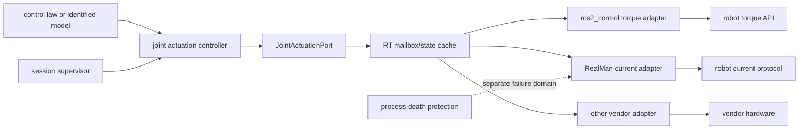

# RFC: 跨机器人关节电流/扭矩直接控制接口

- 状态：**APPROVED FOR IMPLEMENTATION; IMPLEMENTATION FOLLOW-UP ACTIVE**
- 版本：0.3
- 日期：2026-09-04
- 代码状态：已实施首个通用 controller 与 RealMan current adapter；见 [`forward_actuation_controller_implementation.md`](forward_actuation_controller_implementation.md)
- 真机状态：右臂 2 s normal-stop 与 1 s source-timeout supervised current-domain gates PASS；L3 仍被跨主机 ownership 阻断

> 本 RFC 保留实施前的稳定设计理由。用户随后明确要求开始实施，因此代码门已经打开；具体源码、ROS 2 Humble 时序修正、测试结果和硬件 gate 以 implementation follow-up 为准。每次 current/torque 输出仍需单独的现场授权记录。

## 1. 本次希望确认的设计决策

1. 抽象命名为 `JointActuationPort`，通用 C++ 包放在 parent workspace 的 `src/joint_actuation_interface/`。
2. V1 只支持两个不自动换算的命令域：`JOINT_TORQUE_NM` 和 `ACTUATOR_CURRENT_A`。
3. ROS command interface 中，`<joint>/effort` 只表示本 RFC 定义的 SI 关节扭矩；电流使用 `<joint>/actuator_current`，单位 A。
4. V1 只取得 adapter 预声明的完整原子 joint group，不接受调用者任意挑选 subset。
5. 高频闭环控制律留在同进程 C++ controller/adapter；commissioning forward controller 可接收带本机 steady-clock lease 的 `Float64MultiArray`，但 DDS 不是 hardware stop authority。
6. `reserve()` 必须原子取得短时独占 reservation；`activate()` 消耗该 reservation 并完成模式切换与首帧。
7. 硬件批准要求控制进程之外的 process-death protection，可以是设备固件 watchdog、安全 PLC 或独立 guard 进程。
8. source expiry、transport loss、process death、emergency stop 和 normal stop 使用不同的响应与验收条件，不再共用一个模糊的 `ExpiryAction`。
9. 模型、单位转换、adapter、conformance profile 和操作授权是独立证据，任何一项都不能替代另外几项。
10. L3 还要求对所有可达 writer 有权威 ownership；只检查本机端口或 ros2_control claim 最多支持 L2。
11. 每个 L3 计划必须先给出 application hazard budget，所有 source/sender/device/stop 时限都用硬最大值证明落在该预算内。

本文后续设计建立在这些决策之上。修改其中任何一项，都需要重新审查厂商映射和测试矩阵。

## 2. 范围

### 2.1 包含

- 多轴机械臂的关节级直接扭矩或 actuator current 命令；
- capability discovery；
- 独占 reservation 和 session generation；
- 模式切换、首帧、实时 read/write、deadline；
- 状态、限值、watchdog、stop/verify/restore；
- vendor adapter 的共同验收接口。

### 2.2 不包含

- 零力拖动、阻抗、重力或摩擦的具体控制律；
- 参数辨识算法；
- UI 和操作流程；
- 厂商 SDK/JSON/CAN/FRI/FCI 协议实现；
- native freedrive；
- position-backed admittance；
- prismatic joint 的 SI force domain；
- 真机测试参数和授权。

零力拖动以后可以成为本接口的一个消费者，但不能反过来决定 transport API。

## 3. 为什么不能只定义 `write(effort[])`

不同系统中，effort/current/torque 可能表示：

- load-side generalized joint torque；
- motor-shaft torque；
- q-axis current；
- phase RMS/peak current；
- 厂商定义但未公开电机等效关系的 control current；
- bus/supply current；
- raw count；
- 机器人内部 gravity/impedance controller 上的外加 torque overlay。

此外，0 命令可能意味着：

- actuator 不再支撑；
- 仅保留机器人内部重力补偿；
- 保留 position companion；
- 进入 protective stop；
- 只把一个限幅值设为 0，而不是输出 0。

因此，命令数值必须与 quantity、composition、internal compensation、current semantics、模式、deadline 和 stop contract 一起协商。

## 4. 上游接口对比

| 系统 | 主机命令 | 重力/组合语义 | 模式与伴随量 | 超时/停止事实 | 对 RFC 的影响 |
|---|---|---|---|---|---|
| ROS 2 control | `joint/effort` command interface | framework 不定义机器人内部添加了什么 | controller claim；hardware 可实现 prepare/perform switch | Humble group/forward effort controller 默认保留最后值，无 source timeout | 资源名不是 capability；需要本 RFC 的 session 与 timing contract |
| Franka FCI | 7 轴 torque，N·m，1 kHz | 官方 gravity example 发 0 后机器人保留自身重力补偿 | 整组 torque interface；初始 torque 必须为 0 | 丢一帧复用上一 torque；连续丢 20 帧停止；有 torque-rate limit | torque overlay、robot owns gravity、zero initial rule、device loss response |
| KUKA LBR FRI (`lbr-stack`) | N·m torque overlay | overlay 不是完整 actuator output | TORQUE client mode 同时发送 joint position 与 torque；读取 session/safety/drive/mode | 仅 `COMMANDING_ACTIVE` 写；command guard 检查 position/velocity/torque | position companion 和 session-state readback 是 domain capability |
| Universal Robots ROS 2 Driver | 新版 `direct_torque(...)` 通过 effort command 接收 N·m | driver 文档说明 robot 自动补偿重力，输入不含 gravity | 与 joint position/velocity/trajectory mode 互斥；freedrive 独立 | reverse interface 有 receive timeout；通用 forward controller 自身仍无 source lease | 需要额外 source deadline；freedrive 不实现本接口 |
| Kinova Kortex ROS 2 | README/URDF 声明 position/velocity/effort | 未建立可用的直接 effort 语义 | 当前官方仓库 hardware implementation 在 effort 分支直接 `continue` 并注释不支持 | cyclic feedback 有 fault，但没有成功 effort acquisition 证据 | runtime reserve/activate/readback 才能证明 capability，URDF 不足够 |
| ROBOTIS Dynamixel X | Goal Current；例如 XM430 为 2.69 mA/count | current mode 不提供机械臂重力补偿 | current mode、current-based position mode、Torque Enable 分离 | Bus Watchdog 为 20 ms 单位；超时停止并锁 goal register；另有 current/temp/voltage shutdown | current semantics、enable、device watchdog 和 shutdown readback 必填 |
| ODrive | `input_torque` 默认 N·m，经 torque constant 转 current；也可把 torque constant 设为 1 | 不提供机械臂级重力补偿 | torque mode 只保留内层 torque/current loop | watchdog 可选，超时进入 IDLE；有 torque/current/slew/velocity/spinout limits | 字段名不能证明单位；必须绑定真实 torque constant 和 watchdog 配置 |
| RealMan 已验证 direct-current 路径 | `current_canfd` raw，可观测到稳定 raw-to-A 数值 transfer | host 必须提供支撑；0 current 不能托举 | 整臂 current mode；enable 与第一支撑帧不能留空档 | 约 200 Hz、sender gap gate、独立 disable guard、disable/readback/quiet confirm | 暂定 `ACTUATOR_CURRENT_A + vendor_control_current`；不宣称 q-axis current 或 N·m |
| RealMan native drag | firmware `start_drag_teach` | firmware 内部管理 | `current_drag` mode | host 只做 start/stop/readback | native freedrive，不实现本 RFC |

KUKA 条目引用开放的 `lbr-stack` wrapper，不冒充 KUKA 厂商规范。UR 文档与源码中的最低 software version 门槛并不完全一致，未来 adapter 必须报告实际版本并采用单独审阅的、更严格的已测门槛。

## 5. 被拒绝的简化方案

### 5.1 所有机器人统一成 ROS `effort`

拒绝。`effort` 可以作为 proposed torque command resource，但不能承载 current semantics、gravity owner、0 行为、deadline 或 stop evidence。

### 5.2 所有模型先转换成 N·m

拒绝。A/N·m 可能不可辨识或未获批；当前 RM75 J7 是实际反例。

### 5.3 所有机器人统一成 A

拒绝。Franka、UR、KUKA 等公开 joint torque/overlay，不应猜测内部 current。

### 5.4 使用 `Float64MultiArray`

拒绝作为安全边界。它没有 identity、domain、unit、session、sequence、state source 或 deadline，且 forward controller 会保留最后值。

### 5.5 把接口放进参数辨识 Python 包

拒绝。参数辨识包产生模型和证据，不应拥有实时资源、硬件模式或 process-death stop。

### 5.6 把 native freedrive 或 position-backed impedance 当 direct actuation

拒绝。主机没有直接拥有 current/torque vector，测试结论不同。

## 6. 建议的软件边界



### 6.1 `src/joint_actuation_interface/`

建议是 parent workspace 下的独立 `ament_cmake` C++ 包，不放进 Python submodule。

只拥有：

- enum、只读 value types 和 error codes；
- `JointActuationPort`；
- capability/session/state/command/stop contracts；
- 非厂商的 schema validation；
- L0/L1 conformance fixtures。

不拥有：模型、控制律、vendor headers、network endpoint、raw count、operator UI。

### 6.2 generic controller（名称和是否独立包待二次审阅）

负责 session supervisor、实时模型调用、source lease、status publishing 和审计。它是 port 的消费者，不定义 vendor capability。

### 6.3 `robot_parameter_identification`

保持 model/evidence producer。未来只可增加窄 bridge：验证 artifact identity/semantics，并以模型原生 domain 输出。bridge 不打开 socket、不 claim controller、不取得 session。

### 6.4 vendor packages

- `rm_control`：RealMan adapter；
- Franka/UR/KUKA adapter：留在各自集成包或独立 vendor package；
- `rm_impedance_control`：control-law consumer，不成为 transport owner；
- `robot_arm_interfaces`：继续作为高层 ROS IDL，不冻结实时 direct-current API；
- `robot_arm_control`：继续作为既有 topic orchestration，不进入 RT path。

## 7. 命令域

### 7.1 `JOINT_TORQUE_NM`

- quantity：revolute joint generalized torque；
- unit：N·m；
- application point：joint/load side，不是 motor shaft；
- proposed ROS command mapping：`<joint>/effort`；
- 若 native API 实际接收 current，只有获批 conversion domain 才能暴露该 torque domain。

### 7.2 `ACTUATOR_CURRENT_A`

- unit：A；
- proposed ROS command mapping：`<joint>/actuator_current`；
- 不接受 bus/supply current；
- raw count 必须先由 adapter 映射为 A；
- 必须同时声明 `CurrentReference`。

```cpp
enum class CurrentReference {
  kTorqueProducingQAxis,
  kMotorPhaseRms,
  kActuatorInput,
  kVendorControlCurrent,
  kUnknown,
};
```

规范：

- `kTorqueProducingQAxis`：有电机/drive 规格证明 q-axis 定义；
- `kMotorPhaseRms`：必须声明 RMS/peak convention 和相数；
- `kActuatorInput`：必须声明测量/命令位置及 transmission 关系；
- `kVendorControlCurrent`：数值为 A，但内部电机等效关系未公开；可以用于与**同语义、同模式 transfer 已验证**的 current-domain 模型，不可自动转换成 N·m；
- `kUnknown`：只允许 L0 discovery，不得 reserve/activate。

RealMan 当前候选只能是 `kVendorControlCurrent`。已知 raw-to-A transfer 不证明它是 q-axis、phase 或 motor torque constant。

### 7.3 Existing state interfaces

本 RFC 只规定 proposed **command** mapping。现有 driver 的 `JointState.effort` 或 `<joint>/effort` state 不能一概当 N·m；adapter 必须明确证明 state quantity/unit/measurement source。无法证明时，状态只能进入 vendor-named diagnostic field，不能进入 `joint_torque_nm`。

## 8. Identity、joint group 与方向

```cpp
struct JointDescriptor {
  std::string joint_name;
  std::string actuator_id;
  uint32_t hardware_index;
  int command_sign;                 // +1 or -1 relative to q
  std::optional<double> reduction;
  std::string transmission_source;
};

struct RobotIdentity {
  std::string adapter_id;
  std::string vendor;
  std::string model;
  std::string serial;
  std::string firmware;
  std::string capability_revision;
  std::vector<JointDescriptor> joints;
  std::vector<std::string> atomic_groups;
};
```

真机级别必须有 serial 或等价不可混淆 identity。command sign、hardware order 和 actuator mapping 是 capability 的一部分，不能由 vector 下标默认为正确。

V1 建议允许 adapter 预声明多个 atomic group，但 session 只能选择完整 group，不能在请求时任意 subset。

## 9. Domain capability

```cpp
enum class CommandComposition {
  kAbsoluteActuatorOutput,
  kExternalOverlay,
};

enum class GravityOwner {
  kHost,
  kRobot,
};

enum class InitialCommandRule {
  kCallerSupplied,
  kExactZero,
};

enum class CompanionCommand {
  kNone,
  kMeasuredJointPosition,
};
```

每个 domain 必填以下结构。

### 9.1 Physical semantics

- command domain/unit/application point；
- current reference 及 convention；
- composition；
- gravity owner；
- robot 内部添加的 gravity/coriolis/friction/impedance 项；
- zero command 的实际作用；
- sign、transmission、quantization/count resolution；
- conversion chain 和 saturation location（conversion 前/后、host/drive/robot）。

`external overlay + robot gravity` 与 `absolute output + host gravity` 是 V1 的两种允许组合。例外必须新增显式 semantic profile，不能用自由文本绕过交叉校验。

### 9.2 Timing/RT semantics

- nominal/min/max rate；
- source maximum age；
- sender maximum gap；
- device watchdog period；
- command transport latency/jitter bound；
- lifecycle method maximum blocking time；
- RT mailbox write/read bound；
- device/host clock domain及 timestamp reset/wrap rules。

### 9.3 Limits

每关节分别声明：

- peak absolute；
- continuous absolute 及 time window；
- positive/negative asymmetry；
- slew/rate；
- thermal derating；
- native hardware limit；
- adapter hard limit；
- session policy limit；
- limit 来源、单位和应用位置。

session policy 只能比 adapter hard limit 更严格。

### 9.4 State semantics

每个 state field 声明：

- quantity/unit；
- measured、estimated、command echo 或 setpoint；
- source timestamp 和 host receive timestamp；
- freshness；
- 与 command sequence 的 correlation 能力；
- loss-of-feedback response。

position/velocity、actual mode、active owner、fault 和 freshness 是 L3 必需项。current/torque/temp/voltage 是否必需由 adapter conformance profile 决定，但缺失必须显式记录。

### 9.5 Mode/fault semantics

- 所有中间 transition states；
- active mode readback；
- drive/safety/session states；
- fault code、severity、latched/clearable 属性；
- clear fault 的先决条件；
- controller/host/other-host ownership scope；
- endpoint exclusivity 和竞争 owner 检查能力。

### 9.6 Ownership authority

```cpp
enum class OwnershipAuthority {
  kNone,
  kProcessLocal,
  kHostLocal,
  kRobotEnforcedLease,
  kExternalSafetyInterlock,
  kAuditedSingleWriterNetwork,
};
```

capability 必须声明 authority、覆盖的 writer 范围、获取/释放/readback 机制和失效条件：

- `kProcessLocal`：只排除同一进程内竞争；
- `kHostLocal`：例如 OS lock，只排除同一主机；
- `kRobotEnforcedLease`：机器人签发并验证 session/token；
- `kExternalSafetyInterlock`：安全 PLC、网关或等价独立仲裁器；
- `kAuditedSingleWriterNetwork`：物理/网络 ACL 保证只有一个写入主体，并有可审计配置和变更控制。

L3 必须使用后三种之一，并证明覆盖所有能触达 actuator command endpoint 的 local/remote writer。若机器人没有 lease，且现场网络无法证明 single writer，adapter 必须报告 `L3_BLOCKED_OWNERSHIP`，不能把“没有发现竞争者”升级成独占证明。

## 10. StopContract 与 process-death protection

不再用一个 enum 假装所有停止事件相同。

```cpp
struct StopResponse {
  Trigger trigger;                 // source expiry / transport loss / process death /
                                   // emergency stop / normal stop
  Mechanism mechanism;
  ObservablePredicate accepted_state;
  Duration maximum_effect_latency;
  Duration maximum_confirmation_latency;
};

struct ProcessDeathProtection {
  bool present;
  bool verified;
  FailureDomain owner;             // device firmware / safety PLC / separate process
  std::string mechanism_id;
  Duration timeout;
  ObservablePredicate accepted_state;
  AuthenticationMode authentication;
};
```

每个 protection 还必须给出 failure coverage bitset：

```text
controller_process_exit
adapter_process_exit
sender_thread_stall
vendor_call_blocked
host_power_or_kernel_failure
command_network_loss
state_feedback_loss
```

不适用项必须给出理由。一个故障后才启动、仍需连接同一 command endpoint 的 recovery executable 只是 recovery mechanism；除非它在故障前已经 armed，并能在被保护路径卡死时于 deadline 内到达 accepted state，否则不算 process-death protection。

hardware-approved direct-output domain 必须满足：

- `present=true`；
- `verified=true`；
- owner 不在被保护 controller process 内；
- startup/readiness 有 readback；
- failure injection 证明 controller process 死亡后到达 accepted state；
- accepted state 不是“最后命令仍在缓冲区”。

设备 firmware watchdog 可以满足该要求，不强制所有机器人另起 guard process。独立进程如果共用同一进程、同一失效锁或无法取得 endpoint，也不能宣称独立。

`accepted_state` 必须由 observable predicate 定义，例如：

- direct mode 已退出且 output-disabled readback 为真；
- vendor protective stop 已确认；
- robot internal hold active 且 direct external command owner 已撤销。

这些状态不互相等价。是否满足具体应用安全目标由上层 safety plan 再判断。

### 10.1 Per-trigger stop matrix

每个 domain capability 必须为每个 trigger 提供完整独立的一行，不能由 generic fallback 自动补齐：

| Trigger | 谁检测 | 谁执行 | mechanism | hard effect deadline | accepted predicate | verify source |
|---|---|---|---|---|---|---|
| normal stop | session supervisor | adapter slow path | required | required | required | required |
| source expiry | source lease monitor | controller/adapter | required | required | required | required |
| sender stall | sender 外部 monitor | protection owner | required | required | required | required |
| blocked vendor call | sender 外部 monitor | protection owner | required | required | required | required |
| transport loss | adapter/device | device/protection owner | required | required | required | required |
| state feedback loss | receiver 外部 monitor | protection owner | required | required | required | required |
| controller process death | external failure domain | protection owner | required | required | required | required |
| adapter process death | external failure domain | protection owner | required | required | required | required |
| ownership authority loss | authority 外部 monitor | protection owner | required | required | required | required |
| host failure | device/PLC/network interlock | external | L3 required | required | required | required |
| emergency stop | safety system | safety system | normal port 外部 | required | required | required |

`request_stop()` 只服务仍活着的调用者。process death 和 host failure 必须由 port 之外、已经 armed 的 mechanism 执行，重启后再由 read-only recovery path 收集 evidence。

failure coverage bitset 的每一位以及 ownership-authority loss 必须恰好映射到本矩阵的一行。多个 trigger 可以使用同一外部 mechanism，但必须分别给出 detection path、hard deadline、accepted predicate 和 evidence；不得用“由另一行间接覆盖”代替。

## 11. Session lifecycle

### 11.1 API 草案

以下只表示职责，不是最终 ABI：

```cpp
class JointActuationPort {
public:
  virtual Capabilities inspect() const = 0;  // read-only

  virtual ReserveResult reserve(
      const SessionRequest&) = 0;
  virtual CancelResult cancel_reservation(
      const ReservedSession&) = 0;

  virtual ActivateResult activate(
      const ReservedSession&,
      const ActuationCommand& initial) = 0;

  virtual RtResult read_rt(
      const ActiveSession&,
      JointActuationStateView output) noexcept = 0;
  virtual RtResult write_rt(
      const ActiveSession&,
      const ActuationCommandView& command) noexcept = 0;

  virtual StopResult request_stop(
      const ActiveSession&,
      StopTrigger) = 0;
    virtual StopResponse stop_contract(
      CommandDomain,
      StopTrigger) const = 0;
  virtual StopResult verify_stopped(
      const SessionIdentity&) = 0;
  virtual RestoreResult restore(
      const SessionIdentity&) = 0;
};
```

### 11.2 `inspect()`

严格只读。不 reservation、不切模式、不写配置。

### 11.3 `reserve()`

`reserve()` 是唯一 ownership compare-and-swap 点：

- 在 adapter 内锁定 atomic group 和新 generation；
- 拒绝 local/remote/unknown owner；
- 返回带 TTL、capability revision 和 observed resource generation 的 reservation；
- reservation 超时自动撤销；
- reservation 期间不进入 direct mode、不产生 actuator output；
- 任何 preflight 失败都不创建 reservation。

`activate()` 必须核对 reservation 未过期、generation 未变、capability revision 未变。这样避免 inspect/preflight 与模式切换之间的 TOCTOU race。

adapter 内部 reservation 只在 `OwnershipAuthority` 声明的范围内原子，不能声称阻止范围外 writer。L3 reservation 必须同时取得权威 ownership token/interlock，并把 authority identity 写入 `ReservedSession`；activate 前再次 readback。authority 在 transition 中丢失时按独立 stop trigger 处理。

对 ros2_control adapter，controller interface claim 和 hardware prepare switch 必须落入同一 reservation 语义；如果 Controller Manager 无法提供所需原子性，adapter 不得宣称 L3。

### 11.4 `activate(reservation, initial)`

所有 session 都必须提供首帧：

- Franka/UR overlay 候选：exact zero；
- KUKA torque 候选：zero torque + fresh measured-position companion；
- RealMan current 候选：由单独获批 model/safety plan 给出的当前支撑值。

adapter 必须定义并测试：

1. mode switch 成功、first write 失败；
2. 部分关节切换；
3. first write 成功、mode readback 失败；
4. rollback 命令失败；
5. reservation 在 transition 中过期。

成功条件是完整 group、首帧和 mode/owner readback 都确认。失败必须撤销 generation，并到达 StopContract 的 accepted state；无法确认则 latch `CLEANUP_UNCERTAIN`。

### 11.5 RT command

```cpp
struct ActuationCommandView {
  SessionIdentity session;
  CommandDomain domain;
  uint64_t sequence;
  uint64_t generated_from_state_sequence;
  SteadyTime valid_until;
  std::span<const double> values;
  std::span<const double> position_companion_rad;
};
```

要求：

- 完整 atomic-group vector，固定 hardware order；
- domain/session 精确匹配；
- finite；
- sequence 严格递增；
- state sequence 已读且未 stale；
- companion 必须来自该 state sequence；
- deadline 尚未到且不超过 source-age 上限；
- absolute/continuous/slew/derating 全通过；
- latest-value only，不排队补发旧命令。

### 11.6 RT state

```cpp
struct JointActuationStateView {
  uint64_t sequence;
  SteadyTime received_at;
  OptionalDeviceTime device_time;
  std::span<double> position_rad;
  std::span<double> velocity_rad_s;
  OptionalSpan joint_torque_nm;
  OptionalSpan actuator_current_a;
  OptionalSpan temperature_c;
  OptionalSpan bus_voltage_v;
  Span<bool> drive_enabled;
  Span<int64_t> fault_code;
  RuntimeMode actual_mode;
  RuntimeSafetyState safety_state;
  SessionIdentity active_owner;
};
```

扭矩和 current 永远分开。现有 driver 的模糊 `effort` state 只有在 adapter evidence 证明 quantity/unit 后才能映射到 `joint_torque_nm`。

### 11.7 RT execution rules

`read_rt()` / `write_rt()`：

- 配置阶段预分配全部 storage；
- update path 不分配、不释放、不记录日志；
- 不做 DNS/socket connect、同步 request/response 或阻塞 vendor query；
- 不等待普通 mutex；
- bounded execution time；
- 明确 thread affinity；
- 只与 preallocated latest-value mailbox/state cache 交换数据。

vendor network/SDK I/O 运行在 adapter-owned sender/receiver thread，具有独立 deadline 和状态机。lifecycle slow path 可以阻塞，但必须有 capability 声明的上限。

### 11.8 Sender thread contract

把阻塞 I/O 移出 RT thread 仍不足够。每个 adapter 还必须声明并验证：

- 同时最多一个 native send in flight；
- mailbox 为 latest-value overwrite，覆盖时记录 skipped sequence，不形成 queue；
- native call hard completion deadline；
- call 超时后不得再从旧 buffer 发送；
- native call 能否取消；不能取消时由哪个外部 protection 接管；
- sender heartbeat 的观察者必须在 sender thread 之外；
- sender stall 到 trigger、trigger 到 accepted state 的两个 hard maximum；
- blocked SDK/vendor call 不得阻塞 stop authority；
- process-death protection 不依赖正在卡死的同一 lock、SDK context 或 request/response channel。

如果 vendor API 没有可证明的 completion bound，也没有外部 mechanism 能在其阻塞时到达 accepted state，该 adapter 必须报告 `L3_BLOCKED_UNBOUNDED_SEND`。

### 11.9 Stop/verify/restore

```text
ACTIVE
  -> REVOKE_GENERATION
  -> EXECUTE_TRIGGER_SPECIFIC_STOP_RESPONSE
  -> VERIFY_ACCEPTED_STATE
  -> RESTORE_NON_SAFETY_CONFIGURATION
  -> RELEASE_RESERVATION
  -> IDLE
```

若 accepted state 未确认：

- 触发 process-death/emergency protection；
- latch `CLEANUP_UNCERTAIN`；
- 不自动启动前一个 motion controller；
- 不关闭安全 telemetry；
- 不恢复会掩盖 fault 的配置；
- 旧 session 的 write 永久拒绝；
- 只有新的 read-only recovery preflight 可以解除。

## 12. Deadline 与三层 watchdog

每层单独声明和测试：

1. `source lease`：control law 是否产生新 command；
2. `adapter sender watchdog`：host sender 是否按期把 latest value 发送；
3. `device/process-death protection`：controller/host 死亡后谁执行 stop。

capability 对每层记录：present、enabled、timeout、trigger、mechanism、accepted state、readback、evidence id。

跨进程 ROS message 不传绝对 steady-clock time。若未来允许 external ingress，message 只能给 `valid_for`；adapter 收到时用本机 steady clock 计算 deadline。ROS timestamp 仅用于审计。

## 13. ROS 2 映射

### 13.1 Proposed command interfaces

| Domain | ros2_control command interface |
|---|---|
| `JOINT_TORQUE_NM` | `<joint>/effort`，本 RFC 内固定 N·m |
| `ACTUATOR_CURRENT_A` | `<joint>/actuator_current`，固定 A |

raw count 只留在 vendor adapter。

### 13.2 Existing state compatibility

不对现有 `sensor_msgs/JointState.effort` 做全局单位假设。adapter 必须声明：

- driver 实际填入的 quantity；
- unit；
- measured/estimated/echo；
- source；
- 映射证据。

不满足时只能作为 vendor diagnostic，不能作为通用 torque/current state。

### 13.3 Command ingress

V1 的高带宽闭环 path 由 controller plugin 直接调用 port/RT mailbox。实施阶段增加了一个明确受限的 commissioning path：`ForwardActuationController` 在 `~/commands` 接收 exact-length `Float64MultiArray`，以本机 steady clock 执行 100 ms source lease；malformed、non-finite、越限或 timeout 会撤销 generation 并使全部 command resource 失效。DDS 仍不负责 device/process-death stop。低频 ROS API 可在 core ABI 稳定后另行审阅：

- capability query；
- session/status；
- test action 的 start/cancel。

action callback 不执行 RT send。零力拖动、阻抗等高带宽 control law 不通过该 commissioning topic 实现。

### 13.4 Controller naming proposal

对以下上游组织做了精确代码搜索：`ros-controls`、`UniversalRobots`、`ROBOTIS-GIT`、`frankarobotics`、`Kinovarobotics`、`lbr-stack`、`odriverobotics`、`unitreerobotics`。`forward_current_controller`、`ForwardCurrentController` 和 `JointGroupCurrentController` 均为 0 命中。因此该名称不是现有跨机器人标准，也不会与这些主要上游 plugin type 冲突。

UR 的命名方式值得沿用，但要区分 instance 与 plugin：

```yaml
forward_effort_controller:                         # instance name
  type: forward_command_controller/ForwardCommandController
  ros__parameters:
    interface_name: effort
```

`forward_position_controller`、`forward_velocity_controller` 和 `forward_effort_controller` 都是不同 instance，实际加载同一个通用 plugin。ROS Controls 上游只导出：

- `forward_command_controller/ForwardCommandController`；
- `forward_command_controller/MultiInterfaceForwardCommandController`。

本 RFC 建议采用相同层次：

| 层 | Current domain | Torque domain |
|---|---|---|
| controller instance | `<arm>_forward_current_controller` | `<arm>_forward_effort_controller` |
| proposed plugin type | `joint_actuation_controller/ForwardActuationController` | 同一个 plugin |
| explicit parameter | `command_domain: actuator_current_a` | `command_domain: joint_torque_nm` |
| guarded input | `/<instance>/commands` | `/<instance>/commands` |

`forward_current_controller` 因此是推荐的**实例名和用户入口名**，不是通用接口包名，也不是上游已有 plugin type。接口本身仍叫 `JointActuationPort`，因为它同时支持 current 和 torque。

不建议把 plugin type 命名为 `ForwardCurrentController`，理由是：

- 会为 torque 再复制一个几乎相同的 plugin；
- 容易让人误以为它只能 claim 名为 `current` 的底层 interface；
- 实际 adapter 可能使用不同 native resource name。

ROBOTIS 是后一项的直接反例：其官方 Dynamixel hardware interface 把 `Goal Current` 映射到 `HW_IF_EFFORT`。这不是说 current 等于 N·m，而是说明 native ros2_control resource name 也可能带有厂商兼容历史。domain-aware adapter 必须把 native resource 和物理 command domain 分开；用户仍通过 `forward_current_controller` 看到明确的 A-domain contract。

因此 Section 13.1 的名称是本项目新 adapter 的 preferred mapping，而不是对所有既有 driver 的强制重命名。既有 driver 可以由 vendor adapter claim 其 native resource，但不得把 native 名字直接泄漏成通用单位语义。

## 14. Conversion evidence

```cpp
struct ConversionEvidence {
  CommandDomain public_domain;
  std::string native_quantity;
  std::string calibration_id;
  std::string robot_serial;
  std::string firmware;
  std::string artifact_sha256;
  std::vector<double> uncertainty;
  bool direction_dependent;
  bool approved_for_hardware;
};
```

还必须记录：

- sign 和 transmission；
- quantization；
- saturation before/after conversion；
- thermal/voltage operating range；
- fit 与独立 validation；
- command-to-feedback transfer evidence。

`vendor_control_current` 不因 raw-to-A 已知就获得 torque conversion。

## 15. 与参数辨识模型的兼容证据

同为 A 仍不足以兼容。future model bridge 必须输出：

```text
ModelEvidence
  robot identity / serial scope
  joint names, order, sign and topology
  output domain, unit and current reference
  telemetry signal provenance
  identification acquisition mode
  command-vs-measurement semantic relation
  direct-mode transfer evidence
  URDF/model hash
  fit/independent-validation verdict
  software/artifact hashes
  approved_for_hardware
```

例：position-servo 下读取的 diagnostic current 与 direct-current command 都以 A 表示，不代表二者相等。只有单独的 transfer test/evidence 可以建立该关系。

匹配规则：

- current model 只能进入相同 `CurrentReference` 的 current session；
- torque model 只能进入 joint torque session；
- unit 不同由获批 adapter conversion domain 解决，control law 不转换；
- model pass 不等于 adapter/conversion/hardware approval；
- approval 必须绑定 serial、firmware、profile 和 artifact hashes。

### 15.1 Session evidence binding

模型兼容不能只由上层自觉检查。`SessionRequest` 必须携带不可变 evidence bundle：

```text
CommandSourceEvidence
  source_kind            # identified_model / deterministic_test / controller
  source_id and hash
  output domain/unit/current reference

ModelEvidence            # source_kind=identified_model 时必需
ConversionEvidence       # 发生 conversion 时必需
CompatibilityEvidence
  source -> selected domain 的逐项匹配结果
  direct-mode transfer evidence id

SafetyPolicyEvidence
ConformanceProfile hash
AuthorizationEvidence id and scope
```

`reserve()` 必须校验 bundle 与 robot identity、capability revision、atomic group 和 selected domain。任一 hash/semantics 不匹配都不得创建 reservation。`source_kind=deterministic_test` 可以没有 ModelEvidence，但仍必须有精确 command definition、safety policy 和 authorization scope。

## 16. Vendor adapter 候选映射

| Adapter | Domain/reference | Composition/gravity | Initial | Companion | 备注 |
|---|---|---|---|---|---|
| RealMan future direct-current adapter | current / `vendor_control_current` | absolute / host | separately approved support current | none | 当前仅 L2 candidate；跨主机 ownership 和完整 failure coverage 未解决，L3 blocked |
| Franka FCI | joint torque | overlay / robot | exact zero | none | device packet-loss response 可作为 process-death protection 候选，需 adapter evidence |
| UR direct torque | joint torque | overlay / robot | exact zero | none | firmware/version 与 reverse-interface stop 需运行时证明 |
| KUKA via `lbr-stack` | joint torque | overlay / robot | exact zero | fresh measured position | wrapper evidence，不等同厂商认证 |
| Dynamixel current | current / model-specific reference | absolute / host | caller supplied | none | multi-axis adapter 还必须证明 group reservation/sync write |
| ODrive torque | joint torque | absolute / host | caller supplied | none | torque constant 与 device watchdog 必须绑定配置 |
| Kinova current ROS 2 driver | unsupported | unknown | none | none | 当前源码不足以通过 reserve/activate/readback |

`RMSystemHardware` 中保留的 experimental effort/current path **不符合本 RFC**：它通过标准
`effort` 名暴露未校准 current 语义。新的 integrated path 与它互斥，明确导出
`actuator_current`（A），复用经审计的 direct-JSON sender、source lease、health envelope、独立
guard 和 disable/readback，并在同一个 controller manager 内与 position 做全臂原子切换。
这一实现可作为 L2 attended candidate，但不能仅因接口已集成就宣布 L3：多 TCP client 的真机
兼容性、host failure、跨主机 single-writer authority 与完整 fault matrix 仍需单独证据。

现有 `rm_current_emergency_disable` 或 Python guard 需要重新按 failure matrix 分类。它们目前证明特定进程仍能连接时的 recovery/disable，不证明 host failure、SDK deadlock、sender lock 卡死或跨主机竞争时的权威 stop。除非增加 robot/device watchdog、external interlock，或审阅通过的 single-writer network authority，并逐项完成故障注入，RealMan adapter 不得进入 L3。

以上映射均不批准实施或硬件输出。

## 17. Conformance profile

不同机器人频率差异很大，因此 RFC 不假装一个固定毫秒数适用于所有 adapter。每个 adapter 在测试前提交 immutable `ConformanceProfile`，其中数值必须来自厂商限制或单独批准的工程依据。

必填测量项：

- nominal/min achieved command rate；
- maximum sender gap；
- maximum source age；
- reserve TTL；
- activation 中 unsupported-output gap 上限；
- mode transition maximum time；
- stop effect latency；
- stop confirmation timeout；
- post-stop command count；
- post-stop residual output acceptance；
- maximum telemetry age；
- packet-loss patterns；
- controller kill injection offset；
- process-death protection takeover time；
- repeated reserve/activate/stop cycle count；
- endpoint exclusivity checks；
- retry limits；
- cleanup uncertainty acceptance：必须为 0。

profile 在运行前 hash/seal，测试期间不能为了通过而放宽。

### 17.1 Normative predicates

每个测量项必须同时给出 metric definition、clock domain、hard threshold、comparison operator、sample scope 和 required raw evidence。安全时序使用 run maximum，不允许只用平均值或 percentile 代替 hard maximum。

```text
max_observed_sender_gap        <= declared_sender_gap_limit
max_state_age                  <= declared_state_age_limit
max_native_call_time           <= declared_native_call_deadline
max_stop_effect_latency        <= trigger.stop_effect_deadline
max_stop_confirmation_latency  <= trigger.stop_confirmation_deadline
max_process_death_to_effect    <= application_hazard_budget
post_stop_commands             == 0
cleanup_uncertain_events       == 0
ownership_violations           == 0
stale_generation_accepts       == 0
```

时序关系也必须通过：

- command validity 覆盖至少一个预期周期；
- 正常 sender gap limit 小于 device watchdog timeout，并保留预先审阅的 margin；
- source expiry detection + stop effect latency 不超过 application hazard budget；
- sender stall detection + protection takeover 不超过 application hazard budget；
- host/network loss 到 external/device protection effect 不超过 application hazard budget。

packet-loss patterns 必须枚举连续丢包、间歇丢包、反馈单向丢失和命令单向丢失。未测试 pattern 不能默认为 pass。

### 17.2 Sealed evidence record

每次 L2/L3 evidence 至少绑定 robot serial/model/firmware、adapter build hash、capability revision、ConformanceProfile hash、network/SDK config、clock sources、test start/end、每项 raw log hash、predicate result、stop readback 和所有异常。没有 raw evidence 的 summary 不能单独授予等级。

## 18. Conformance 等级

### L0：schema/semantic review

- identity、group、domain、current reference、sign、units 完整；
- composition/gravity/zero semantics 无矛盾；
- limits、timing、state、watchdog、stop source 可审计；
- `CurrentReference::kUnknown` 仅可停留在此级；
- 不连接硬件。

### L1：fake lifecycle

- concurrent reserve 只有一个成功；
- expired/cancelled reservation 不能 activate；
- capability revision 改变后旧 reservation 失效；
- partial group、错序、错单位、NaN、越限、重放、过期命令全拒绝；
- activation 五类 partial-failure matrix；
- generation 撤销后不能复活；
- source/adapter/device 三层 timeout 分开 fault injection；
- stop 未确认时禁止 restore previous motion owner；
- 无硬件。

### L2：adapter loopback/simulator

- 实际 serialization 和 mode state machine；
- sender/receiver thread deadline；
- latency/jitter/gap metrics；
- packet loss、socket failure、process death；
- stop/readback/ownership；
- binary dependency audit 证明 generic core 不导入 vendor API；
- 无真实 actuator output。

### L3：hardware adapter capability

先单独审阅 L3 计划，且必须：

- process-death protection 由外部 failure domain 提供并已验证；
- ownership authority 覆盖所有可达 writer；
- failure coverage matrix 覆盖 controller、adapter、sender、blocked vendor call、host/network 和 feedback loss；
- application hazard budget 预先批准，全部 hard timing predicates 在预算内；
- 使用预批准 ConformanceProfile；
- identity/firmware/config snapshot；
- fixture/no-load/minimum bounded command；
- 只验证 adapter，不运行零力拖动；
- stop/postflight/no-owner evidence；
- cleanup uncertainty 为 0；
- 每个 command domain 独立批准。

### L4：应用验证

零力拖动、阻抗等 control law 使用自己的模型、envelope、operator protocol 和成功标准。L4 不能反向替代 L0-L3。

## 19. 审阅后才可能开始的实施顺序

1. 经你明确批准 RFC 后，只建立 `src/joint_actuation_interface` 的 enum/value types、schema validation 和 L0 tests；无 I/O。
2. 再次审阅 C++ ABI 后建立 fake port 和 L1 matrix。
3. 另行审阅 ros2_control torque loopback adapter，完成 L2；无真机。
4. 另行设计 RealMan current adapter，完成 L2；无真机。
5. 分别审阅 adapter capability、ConformanceProfile 和 stop contract。
6. 单独授权后才设计 L3。
7. L3 通过后，另写零力拖动应用 RFC。

任何阶段都不因本文存在而自动获准。

## 20. 仍需你决定

1. 是否接受 `joint_actuation_interface` / `JointActuationPort` 命名？
2. 是否接受 `ACTUATOR_CURRENT_A`，并允许 `vendor_control_current` 在有同语义 transfer evidence 时用于 current-domain 控制，但永不自动转换 N·m？
3. 是否接受 adapter 预声明多个 atomic groups，但禁止调用时 arbitrary subset？
4. 是否接受 proposed ROS command 边界：`effort=N·m`、`actuator_current=A`？
5. `composition` 与 `gravity_owner` 是否保持独立字段并交叉校验？
6. 是否接受最终实施边界：DDS 仅作为 lease-guarded commissioning ingress，高带宽闭环仍为进程内 path？
7. 是否接受 `reserve()` 有 ownership side effect，但不改变 hardware mode/output？
8. cleanup 未确认时，是否禁止自动恢复 previous motion controller 并 latch fault？
9. process-death protection 是否作为所有 L3 direct-output domain 的硬条件？
10. 第一批 adapter 是否按 torque loopback -> RealMan current loopback 顺序？
11. ConformanceProfile 的 adapter-specific 数值由谁批准：接口维护者、vendor adapter owner，还是二者共同签署？
12. 是否接受“没有 robot-enforced lease、external interlock 或 audited single-writer network 就不能 L3”的硬门槛？
13. RealMan 若无法覆盖 host failure 与 blocked vendor call，是保持 L2-only，还是在实施前先引入外部 watchdog/interlock？
14. 是否接受 controller instance 使用 `<arm>_forward_current_controller` / `<arm>_forward_effort_controller`，二者共用 `joint_actuation_controller/ForwardActuationController` plugin？

## 21. 资料来源

- ROS 2 control Humble：[hardware interface types](https://control.ros.org/humble/doc/ros2_control/hardware_interface/doc/hardware_interface_types_userdoc.html)、[effort controller](https://control.ros.org/humble/doc/ros2_controllers/effort_controllers/doc/userdoc.html)、[forward controller](https://control.ros.org/humble/doc/ros2_controllers/forward_command_controller/doc/userdoc.html)、upstream [mode switching](https://github.com/ros-controls/ros2_control/blob/master/hardware_interface/include/hardware_interface/resource_manager.hpp) 与 [forward update loop](https://github.com/ros-controls/ros2_controllers/blob/master/forward_command_controller/src/forward_controllers_base.cpp)。
- Franka 官方：[control limits](https://frankarobotics.github.io/docs/robot_specifications.html)、[1 kHz/network requirements](https://frankarobotics.github.io/docs/doc/libfranka/docs/system_requirements.html)、[ROS 2 gravity example](https://frankarobotics.github.io/docs/doc/franka_ros2_humble/franka_example_controllers/doc/index.html)、upstream [hardware interface](https://github.com/frankarobotics/franka_ros2/blob/jazzy/franka_hardware/src/franka_hardware_interface.cpp)。
- KUKA FRI 开源 wrapper `lbr-stack`：[torque command](https://github.com/lbr-stack/lbr_fri_ros2_stack/blob/jazzy/lbr_fri_ros2/src/interfaces/torque_command.cpp)、[command guard](https://github.com/lbr-stack/lbr_fri_ros2_stack/blob/jazzy/lbr_fri_ros2/src/guards/command_guard.cpp)、[ros2_control controller](https://github.com/lbr-stack/lbr_fri_ros2_stack/blob/jazzy/lbr_ros2_control/src/controllers/lbr_torque_command_controller.cpp)。
- Universal Robots 官方 upstream：[forward controller instance/type mapping](https://github.com/UniversalRobots/Universal_Robots_ROS2_Driver/blob/main/ur_robot_driver/doc/usage/position_velocity_control.rst)、[force/torque control](https://github.com/UniversalRobots/Universal_Robots_ROS2_Driver/blob/main/ur_robot_driver/doc/usage/force_torque_control.rst)、[hardware mode switch](https://github.com/UniversalRobots/Universal_Robots_ROS2_Driver/blob/main/ur_robot_driver/src/hardware_interface.cpp)、[freedrive controller](https://github.com/UniversalRobots/Universal_Robots_ROS2_Driver/blob/main/ur_controllers/src/freedrive_mode_controller.cpp)。
- Kinova 官方 upstream：[driver README](https://github.com/Kinovarobotics/ros2_kortex/blob/main/kortex_driver/README.md)、[hardware implementation](https://github.com/Kinovarobotics/ros2_kortex/blob/main/kortex_driver/src/hardware_interface.cpp)。
- ROBOTIS 官方：[Dynamixel XM430 control table](https://docs.robotis.com/docs/dxl/model_reference/x_series/xm_series/xm430-w350/)、[Goal Current 与 ROS 2 effort mapping](https://github.com/ROBOTIS-GIT/dynamixel_hardware_interface/blob/main/include/dynamixel_hardware_interface/dynamixel_hardware_interface.hpp)。
- ODrive 官方：[controller guide](https://docs.odriverobotics.com/v/latest/manual/control.html)、[API reference](https://docs.odriverobotics.com/v/latest/fibre_types/com_odriverobotics_ODrive.html)。
- 本仓库 RealMan 证据：[identified_static_hold.py](../../../tools/identified_static_hold.py)、[native_joint_drag.py](../../../tools/native_joint_drag.py)、[rm_system_hardware.cpp](../../../src/rm_control/src/rm_system_hardware.cpp)、[rm_current_emergency_disable.cpp](../../../src/rm_control/src/rm_current_emergency_disable.cpp)。
